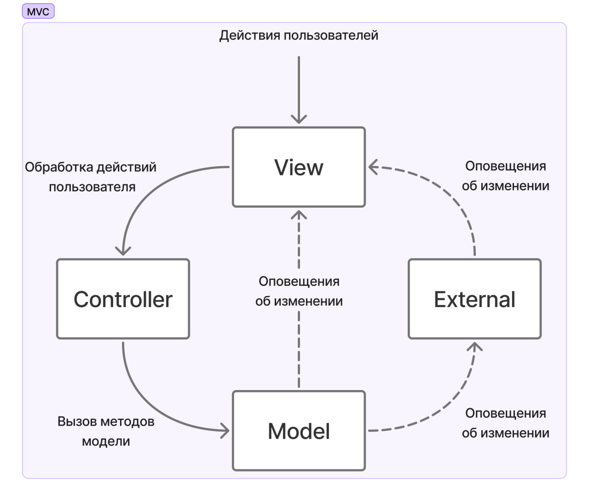

# Задача 3. Сапер

Написать аналог игры «Сапер» (“Minesweeper”) из состава стандартных программ для Windows OS.

Архитектура программы должна быть основана на паттерне MVC (Mode-View-Controller):

Поведение должно быть такое же, как у оригинальной игры.
