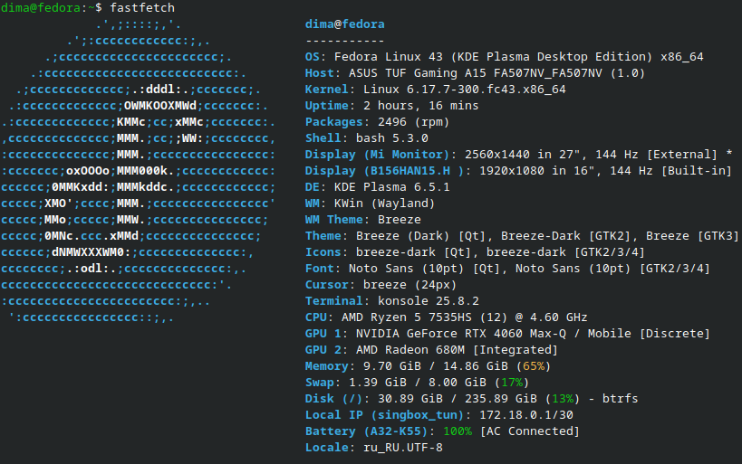
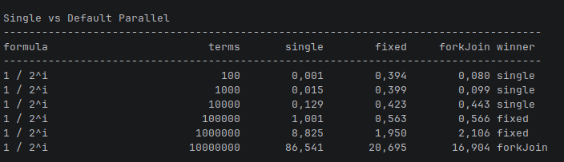
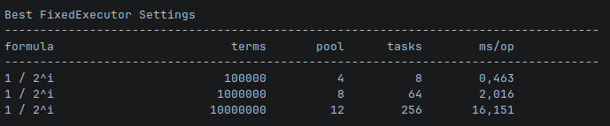
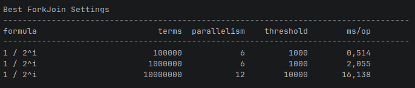
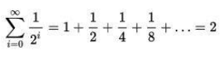

# Задача 4. Многопоточные вычисления

## Описание задачи

1. Вычисляет какую-либо сложную функцию для каждого целого числа от
   1 до N, N – входной параметр (большое число, например, 10 000 000).
   N – ввод с консоли.
2. Выводит на экран сумму посчитанных значений
3. Поскольку N – большое, необходимо разбить вычисления на несколько
   частей и каждую часть вычислить в отдельном потоке параллельно.
4. Для каждой части создать объект Task, внутри которого запомнить
   данные для начала вычислений, а так же сохранить результат после
   завершения вычислений.
5. Каждый поток работает со своим объектом Task.
6. В приложении должно использоваться логирование. Обязательно
   должен быть настроен логгер, выводящий логи в консоль, логгер
   выводящий логи в файл - по желанию.
7. Задача должна быть выполнена с использованием java.concurrency

## На какой машине проводились вычисления



## JMH

### Тест

Были сделаны замеры производительности, чтобы понять, до какого момента вычисления без многопотока будут быстрее, чем вычисления с ним.

По замерам было выявлено, что до 100_000 выигрывает Single Thread, но дальше уже лучше параллелить задачу:



Также были написаны тюнеры, чтобы найти оптимальные значения для моей машины, как для FixedExecutor, так и для ForkJoin.

Оптимальные значения, которые я нашёл тюнером, взял усреднённые:





**Важное уточнение:**  
все замеры проводились с использованием этой формулы:



### Инструкция по запуску

**Важно:** время выполнения JMH может быть довольно долгим, поэтому лучше поиграться с параметрами в:

```shell
FixedExecutorTuningBenchmark
ForkJoinTuningBenchmark
SingleVsParallelBenchmark
```

Для запуска тюнера для `FixedExecutor`:

```sh
./gradlew jmhFixedTuning
```

Для запуска тюнера для `ForkJoin`:

```sh
./gradlew jmhForkJoinTuning
```

Для запуска теста, где проверяется момент, когда однопоточный запуск оказывается лучше:

```sh
./gradlew jmhSingleVsParallel
```

Можно запустить всё разом:

```sh
./gradlew jmh
```

## Консольная утилита (main)

Консольная утилита сделана в соответствии с заданием, но дополнительно можно выбрать, какой пул использовать: `fixed` или `fork`.

### Параметры запуска

При запуске утилиты можно указать:

1. Проводить ли замер времени выполнения: `--time`
2. Threshold, после которого будет включён многопоток: `-t`, `--threshold`
3. Кол-во тредов в пуле для `ForkJoin` и `Fixed`: `--fixed-threads`, `--fork-threads`
4. Кол-во тасок для `Fixed` пула: `--fixed-tasks`
5. Threshold для разбиения в `ForkJoin` пуле: `--fork-threshold`

### Поведение по умолчанию

Если при запуске не введено кол-во потоков, будет использоваться кол-во потоков, равное кол-ву процессоров на запускаемой машине.

Если не введено кол-во тасок для `Fixed` пула, будет использоваться дробление ряда на количество тасок, равное количеству указанных `Fixed` потоков.

Если не будет введено `threshold` для `ForkJoin` пула или `threshold` для запуска многопотока, будут использоваться стандартные значения.
